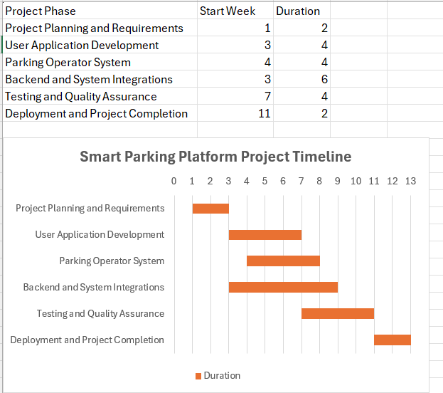

# Smart Parking Platform
### Semester Project

**Company:** WE ARE Software Corp.  
**Document Version:** 5.0  
**Last Updated:** October 8, 2026

---

## Table of Contents

1. [Research: Existing Software Landscape](#1-research-existing-software-landscape)
2. [Vision and Scope](#2-vision-and-scope)
3. [Software Requirements Specification (SRS)](#3-software-requirements-specification-srs)
4. [Work Breakdown Structure (WBS)](#4-work-breakdown-structure-wbs)
5. [Project Timeline and Gantt Chart](#5-project-timeline-and-gantt-chart)
6. [Product Backlog and Sprint 1](#6-product-backlog-and-sprint-1)
7. [Risk Management](#7-risk-management)
8. [Communication Plan](#8-communication-plan)
9. [Roles and Resources](#9-roles-and-resources)
10. [Resource and Cost Plan](#10-resource-and-cost-plan)
11. [RACI Matrix](#11-raci-matrix)
---

## 1. Research: Existing Software Landscape
The smart parking market already includes several software solutions that help drivers locate, manage, and pay for parking. Three existing solutions reviewed for this project are Parkopedia, SpotAngels, and PayByPhone. Each platform addresses different parts of the parking experience and provides useful examples of features that can be incorporated or improved upon in the Smart Parking Platform.

### Parkopedia

Parkopedia is a parking information service designed to help drivers locate parking in different areas. It provides information about parking locations, which makes it useful for drivers who want to research parking options before or during a trip.

**Strengths:**
- Provides extensive parking location information.
- Helps drivers compare available parking options.
- Useful for planning where to park before arriving at a destination.

**Weaknesses:**
- The experience can depend on the parking information available for a particular location.
- Finding parking information does not necessarily provide drivers with one complete system for every part of the parking process.

**Opportunity for Differentiation:**  
The Smart Parking Platform can combine parking discovery with real-time availability, reservations, payments, navigation assistance, notifications, and parking management within one system.

### SpotAngels

SpotAngels is a parking application that helps drivers find parking and understand street parking rules. It can show free parking options, provide reminders about parking restrictions, remember where a vehicle was parked, and help users avoid parking tickets.

**Strengths:**
- Strong focus on street parking information and parking rules.
- Helps users locate free parking.
- Provides reminders that can help drivers avoid tickets.
- Includes parking location and garage information.

**Weaknesses:**
- Some payment and booking capabilities are only available in certain locations or through partner services.
- Its strongest features focus on the driver's street-parking experience rather than providing a complete management system for parking operators.

**Opportunity for Differentiation:**  
The Smart Parking Platform can provide useful information for drivers while also giving parking operators administrative tools, occupancy information, analytics, and other management capabilities.

### PayByPhone

PayByPhone is a digital parking service that allows drivers to pay for parking through a mobile application or other supported payment methods. Users can select a parking location, choose a parking duration, make a payment, receive notifications, and extend eligible parking sessions remotely. The service also supports additional parking capabilities in certain locations, including reservations and off-street parking.

**Strengths:**
- Makes parking payments convenient and cashless.
- Allows eligible parking sessions to be extended remotely.
- Provides notifications before parking sessions expire.
- Supports nearby parking locations and multiple vehicles.
- Offers reservation and off-street parking features in supported locations.

**Weaknesses:**
- Available features vary depending on the parking location and operator.
- Some parking functions require users to identify or enter a specific parking location.
- Reservation availability is not currently universal across all locations.

**Opportunity for Differentiation:**  
The Smart Parking Platform can create a more unified experience by combining real-time space availability, interactive maps, reservations, payments, navigation, parking history, alerts, and operator management tools.

### Competitive Analysis Summary

The research shows that existing parking applications solve important parts of the parking problem, but their capabilities and areas of focus differ. The Smart Parking Platform will build on these existing ideas by providing a more integrated system for both drivers and parking operators. Drivers will be able to locate available spaces in real time, reserve parking, navigate to parking locations, make digital payments, receive notifications, and access reservation history. Parking operators will also have access to administrative tools, occupancy reporting, and analytics. This combination creates an opportunity to provide parking discovery, transactions, and management through one platform.

## 2. Vision and Scope
### Company Background

WE ARE Software Corp. is a software development company that designs technology solutions for organizations and communities. For this semester project, the company has unlimited theoretical resources and budget to plan and develop the Smart Parking Platform.

### Project Acquisition

WE ARE Software Corp. was approached by a group of parking facility operators and city transportation representatives seeking a technology solution to improve the parking experience in busy urban areas. Drivers frequently spend unnecessary time searching for available parking, which can contribute to traffic congestion, frustration, and lost productivity. Parking operators also need better tools to monitor occupancy, manage parking activity, and understand how their facilities are being used.

After reviewing these needs, WE ARE Software Corp. accepted the project and began planning the Smart Parking Platform as a centralized solution for drivers and parking operators.

### Project Vision

The vision of the Smart Parking Platform is to make finding and managing parking more efficient by connecting drivers with real-time parking information and providing parking operators with tools to manage their facilities.

The platform will be accessible through web and mobile applications. Drivers will be able to locate available parking, view parking locations on an interactive map, reserve spaces, receive navigation assistance, make digital payments, receive notifications, and review previous reservations and receipts. Parking operators will be able to monitor parking activity and access management and reporting tools.

### Business Need

Drivers can spend significant amounts of time searching for parking, especially in busy areas. This can increase congestion and create an inconvenient parking experience. At the same time, parking facility operators need accurate information and effective tools for monitoring occupancy, pricing, and facility utilization.

The Smart Parking Platform is intended to address both sides of this problem by providing drivers with easier access to parking information and services while providing operators with tools to manage their parking facilities more effectively.

### Project Scope

The initial scope of the Smart Parking Platform includes:

- User registration and authentication
- Real-time parking availability
- An interactive map of available parking locations
- Parking space reservations
- Digital parking payments
- Reservation history and receipts
- Navigation assistance to parking locations
- Notifications and parking alerts
- An administrative dashboard for parking operators
- Occupancy reporting and analytics
- Integration with external mapping and navigation services
- Integration with third-party payment services

The system will involve coordinated development across the mobile application, web application, backend and API services, mapping and location services, payment integration, and quality assurance teams.

### Stakeholders

The primary stakeholders for the Smart Parking Platform include drivers and vehicle owners, parking facility operators, city transportation departments, system administrators, finance and billing personnel, mobile application users, and third-party payment providers. Each stakeholder group has different needs that will be considered as requirements are gathered and refined throughout the project.

### Constraints and Considerations

Although WE ARE Software Corp. has an unlimited theoretical development budget for this project, development must be planned within the fixed semester timeline. The platform will also depend on third-party services and APIs for certain functions, including payment processing and mapping. Security, user privacy, applicable city ordinances, and other legal requirements must also be considered throughout the development process.

## 3. Software Requirements Specification (SRS)
### Purpose

The Software Requirements Specification (SRS) defines the initial functional requirements for the Smart Parking Platform. These requirements describe how drivers, parking operators, administrators, and external services will interact with the system. The requirements will continue to be reviewed and expanded as the project develops throughout the semester.

### Functional Requirements

The Smart Parking Platform shall:

- Allow users to create and manage an account.
- Authenticate registered users before allowing access to protected account features.
- Display available parking locations through an interactive map.
- Provide current parking availability information for participating parking facilities.
- Allow drivers to search for parking based on a destination or location.
- Allow drivers to reserve eligible parking spaces.
- Process digital payments through an integrated third-party payment service.
- Provide navigation assistance to a selected parking location.
- Send users notifications and alerts related to their parking activity.
- Maintain a history of a user's reservations and parking transactions.
- Provide users with digital receipts for completed payments.
- Allow parking operators to manage information about their parking facilities.
- Allow parking operators to monitor parking occupancy.
- Provide parking operators with reports and analytics about facility utilization.
- Allow authorized administrators to manage platform users and system information.

### Non-Functional Requirements

The platform should provide a user-friendly experience across supported web and mobile devices. User account and payment information must be protected using appropriate security measures. The system should provide reliable access to parking information and should be designed to support increased numbers of users and participating parking facilities as the platform grows. The system must also account for applicable privacy requirements, security standards, and local regulations.

### Initial Use Cases

#### UC-01: Create User Account
**Primary Actor:** Driver  
**Description:** A new user creates an account by providing the required registration information. The system validates the information and creates the user's account.

#### UC-02: Log In to Platform
**Primary Actor:** Registered User  
**Description:** A registered user enters valid credentials to securely access their account and available platform features.

#### UC-03: Search for Parking
**Primary Actor:** Driver  
**Description:** A driver enters a destination or searches an area to find nearby participating parking locations.

#### UC-04: View Parking Availability
**Primary Actor:** Driver  
**Description:** A driver views current parking availability for participating parking facilities to determine where spaces may be available.

#### UC-05: View Parking Locations on Map
**Primary Actor:** Driver  
**Description:** A driver uses the interactive map to view parking locations near a selected destination.

#### UC-06: View Parking Location Details
**Primary Actor:** Driver  
**Description:** A driver selects a parking location to view relevant information such as availability, pricing, and location details.

#### UC-07: Reserve Parking
**Primary Actor:** Driver  
**Description:** A driver selects an eligible parking option and reserves parking for a specified date or time period.

#### UC-08: Pay for Parking
**Primary Actor:** Driver  
**Supporting Actor:** Third-Party Payment Provider  
**Description:** A driver submits payment for a parking reservation or eligible parking session through the platform's integrated payment service.

#### UC-09: Receive Navigation Assistance
**Primary Actor:** Driver  
**Supporting Actor:** External Mapping Service  
**Description:** A driver requests directions to a selected parking location and receives navigation assistance through an integrated mapping service.

#### UC-10: Receive Parking Notifications
**Primary Actor:** Driver  
**Description:** The system sends relevant alerts or notifications concerning reservations, payments, parking sessions, or other important parking activity.

#### UC-11: View Reservation History
**Primary Actor:** Driver  
**Description:** A driver accesses their account to review current and previous parking reservations.

#### UC-12: View Payment Receipt
**Primary Actor:** Driver  
**Description:** A driver views a digital receipt containing information about a completed parking payment.

#### UC-13: Manage User Profile
**Primary Actor:** Registered User  
**Description:** A registered user reviews or updates eligible account and profile information.

#### UC-14: Manage Parking Facility Information
**Primary Actor:** Parking Facility Operator  
**Description:** An authorized parking operator adds or updates information associated with a participating parking facility.

#### UC-15: Monitor Facility Occupancy
**Primary Actor:** Parking Facility Operator  
**Description:** A parking operator views occupancy information to monitor the usage and availability of parking within a facility.

#### UC-16: View Parking Analytics
**Primary Actor:** Parking Facility Operator  
**Description:** A parking operator accesses reports and analytics to evaluate parking utilization and activity.

#### UC-17: Manage Platform Users
**Primary Actor:** System Administrator  
**Description:** An authorized system administrator manages user accounts and performs permitted administrative actions.

#### UC-18: Manage Pricing Information
**Primary Actor:** Parking Facility Operator  
**Description:** An authorized parking operator reviews or updates applicable parking pricing information for a participating facility.

### SRS Status

This SRS represents the initial set of requirements and use cases for the Smart Parking Platform. Additional requirements, exceptions, business rules, and detailed use case flows will be identified through stakeholder analysis and requirements elicitation as the project progresses.

---

## 4. Work Breakdown Structure (WBS)

The Work Breakdown Structure (WBS) divides the Smart Parking Platform project into major areas of work and smaller tasks required to complete the system. The structure includes project planning, application development, system integrations, testing, and deployment activities.

### 1.0 Smart Parking Platform

#### 1.1 Project Planning and Requirements
- 1.1.1 Identify project stakeholders
- 1.1.2 Gather and document system requirements
- 1.1.3 Define project scope and objectives
- 1.1.4 Develop project schedule and milestones

#### 1.2 User Application Development
- 1.2.1 Develop user registration and authentication
- 1.2.2 Develop parking search and interactive map
- 1.2.3 Develop parking reservation functionality
- 1.2.4 Develop digital payment functionality
- 1.2.5 Develop reservation history and receipts
- 1.2.6 Develop notifications and alerts

#### 1.3 Parking Operator System
- 1.3.1 Develop parking facility management tools
- 1.3.2 Develop occupancy monitoring features
- 1.3.3 Develop pricing management features
- 1.3.4 Develop reporting and analytics dashboard

#### 1.4 Backend and System Integrations
- 1.4.1 Develop backend database and APIs
- 1.4.2 Integrate real-time parking availability data
- 1.4.3 Integrate mapping and navigation services
- 1.4.4 Integrate third-party payment services
- 1.4.5 Implement security and privacy controls

#### 1.5 Testing and Quality Assurance
- 1.5.1 Conduct functional testing
- 1.5.2 Conduct integration testing
- 1.5.3 Conduct security and performance testing
- 1.5.4 Conduct user acceptance testing
- 1.5.5 Resolve identified defects

#### 1.6 Deployment and Project Completion
- 1.6.1 Prepare production environment
- 1.6.2 Deploy web and mobile applications
- 1.6.3 Complete final system verification
- 1.6.4 Prepare project documentation
- 1.6.5 Complete project handoff and closure

## 5. Project Timeline and Gantt Chart

The following draft timeline outlines the planned sequence of activities for the Smart Parking Platform. The schedule is based on the major work areas identified in the Work Breakdown Structure and may be adjusted as project requirements and development needs change throughout the semester.

### Draft Project Timeline

| Project Phase | Planned Duration |
| --- | --- |
| Project Planning and Requirements | Weeks 1–2 |
| User Application Development | Weeks 3–6 |
| Parking Operator System | Weeks 4–7 |
| Backend and System Integrations | Weeks 3–8 |
| Testing and Quality Assurance | Weeks 7–10 |
| Deployment and Project Completion | Weeks 11–12 |

### Gantt Chart

*Figure 1. Smart Parking Platform Project Timeline.*

## 6. Product Backlog and Sprint 1

### Product Backlog

The product backlog for the Smart Parking Platform was created and organized in Trello. The backlog contains 45 items across four major categories: login, user and operator interface, backend processes, and reporting.

| Backlog Category | Number of Items |
|---|---:|
| Login | 5 |
| UI - Operator and User | 15 |
| Backend - Operator and User | 15 |
| Reporting - Operator and User | 10 |
| **Total** | **45** |

### Sprint 1 Backlog

Sprint 1 focuses on establishing the operator backend and core functionality needed to support the Smart Parking Platform. Seven items from the product backlog were prioritized for the first sprint:

1. Create User Account
2. User and Operator Login
3. Authenticate User and Operator Login
4. Update Parking Facility Information
5. Update Parking Pricing
6. Track Parking Occupancy
7. Retrieve Real-Time Parking Availability

### Trello Product Backlog

*Figure 2. Smart Parking Platform product backlog organized into login, user and operator UI, backend processes, and reporting categories.*

### Sprint 1 Trello Board

*Figure 3. Sprint 1 backlog focused on operator backend and core platform functionality.*

## 7. Risk Management

Risk management is important to the Smart Parking Platform because technical, schedule, financial, and people-related issues could affect the successful completion of the project. The following risks have been identified so they can be monitored and addressed throughout the project lifecycle.

### Risk Identification

#### Technical Risks

1. Real-time parking availability data may be inaccurate or delayed.
2. Third-party mapping and navigation services may experience outages or integration failures.
3. Payment processing integration may fail or experience security vulnerabilities.
4. The platform may experience performance or scalability issues during periods of high user activity.

#### Schedule Risks

1. Third-party API integration may take longer than originally planned.
2. Delays in backend development may prevent other development teams from completing dependent tasks on schedule.
3. Testing may identify major defects that require additional development time.
4. Changes to project requirements during development may cause scheduled activities to be delayed.

#### Financial Risks

1. Third-party mapping or navigation services may introduce unexpected usage costs.
2. Payment processing services may charge higher transaction or integration fees than expected.
3. Additional cloud infrastructure may be required if platform usage exceeds initial estimates.
4. Unexpected development or testing needs may increase overall project costs.

#### People Risks

1. Key team members may become unavailable during important development activities.
2. Poor communication between development teams may cause misunderstandings or duplicated work.
3. Team members may lack experience with specific third-party APIs or technologies required by the platform.
4. Conflicting priorities or workload between teams may delay completion of assigned tasks.

### Risk Register

The following risk register documents key risks that may affect the Smart Parking Platform. Each risk is evaluated based on its probability and impact, assigned to an appropriate owner, and given a response strategy for managing the risk.

| ID | Risk Description | Probability | Impact | Owner | Response Strategy | Status / Notes |
|---|---|---|---|---|---|---|
| R1 | Real-time parking availability data may be inaccurate or delayed. | Medium | High | Backend/API Team | Validate incoming parking data and implement error handling and backup procedures. | Open - Monitor data accuracy |
| R2 | Third-party mapping and navigation services may experience outages or integration failures. | Medium | High | Mapping/Location Team | Test integrations regularly and prepare alternative service options if necessary. | Open - Monitor third-party service |
| R3 | Payment processing integration may fail or experience security vulnerabilities. | Low | High | Payment Integration Team | Use secure payment APIs, perform security testing, and monitor payment failures. | Open - Security testing required |
| R4 | The platform may experience performance or scalability issues during periods of high user activity. | Medium | High | Backend/API Team | Conduct performance testing and scale cloud resources based on system demand. | Open - Performance testing planned |
| R5 | Third-party API integration may take longer than originally planned. | Medium | Medium | Project Manager | Track integration progress and adjust development priorities if delays occur. | Open - Monitor schedule |
| R6 | Delays in backend development may prevent other teams from completing dependent tasks on schedule. | Medium | High | Backend/API Team | Prioritize critical backend services and communicate delays to dependent teams early. | Open - Monitor dependencies |
| R7 | Testing may identify major defects that require additional development time. | Medium | Medium | QA/Testing Team | Begin testing early and prioritize critical defects for immediate resolution. | Open - Testing scheduled |
| R8 | Third-party services may introduce unexpected usage or transaction costs. | Medium | Medium | Finance/Billing Team | Monitor service usage and costs and evaluate alternative providers when necessary. | Open - Monitor expenses |
| R9 | Key team members may become unavailable during important development activities. | Low | High | Project Manager | Cross-train team members and document important project knowledge and responsibilities. | Open - Monitor availability |
| R10 | Poor communication between development teams may cause misunderstandings or duplicated work. | Medium | Medium | Project Manager | Hold regular cross-team meetings and maintain shared project documentation. | Open - Communication plan established |

## 8. Communication Plan

The communication plan defines how project teams and stakeholders will share updates, coordinate work, report issues, and monitor the progress of the Smart Parking Platform. Regular communication will help identify blockers early and keep teams aligned throughout the project.

| Team / Stakeholder | Meeting Cadence | Communication Method | Reporting / Information Shared |
|---|---|---|---|
| Project Management Team | Weekly | Project status meeting | Overall project progress, schedule updates, risks, and major decisions |
| Mobile Development Team | Daily | Stand-up meeting | Current tasks, completed work, blockers, and upcoming development activities |
| Web Development Team | Daily | Stand-up meeting | Current tasks, completed work, blockers, and UI development progress |
| Backend/API Team | Daily | Stand-up meeting | API development, database progress, integrations, and technical blockers |
| Mapping/Location Team | Twice Weekly | Team meeting | Mapping integration, navigation services, and real-time location issues |
| Payment Integration Team | Twice Weekly | Team meeting | Payment integration progress, transaction issues, and security concerns |
| QA/Testing Team | Twice Weekly | Testing status meeting | Test results, identified defects, resolved issues, and testing progress |
| Parking Facility Operators | Weekly | Stakeholder meeting / email update | Operator requirements, parking availability, pricing, and system feedback |
| Finance/Billing Team | Weekly | Email report / status meeting | Payment activity, transaction issues, service costs, and billing concerns |
| Project Stakeholders | Weekly | Project update report / video | Project progress, completed milestones, current risks, and upcoming work |

## 9. Roles and Resources

The Smart Parking Platform project will be supported by a fictional team of nine professionals from WE ARE Software Corp. Each team member is assigned a specific role based on the project's development requirements. Skill levels and resource allocations are estimated for the 12-week project timeline.

### Project Resource Allocation

| Role | Fictional Name | Skill Level | Allocation (FTE %) | Estimated Hours | Hourly Rate | Estimated Cost |
|---|---|---|---|---|---|---|
| Project Manager | Jordan Mitchell | Senior | 50% | 240 | $65 | $15,600 |
| Mobile Developer | Taylor Brooks | Mid-Level | 75% | 360 | $55 | $19,800 |
| Web Developer | Alex Morgan | Mid-Level | 75% | 360 | $50 | $18,000 |
| Backend/API Developer | Cameron Davis | Senior | 100% | 480 | $70 | $33,600 |
| Mapping/Location Specialist | Riley Parker | Mid-Level | 50% | 240 | $55 | $13,200 |
| Payment Integration Specialist | Casey Williams | Senior | 50% | 240 | $65 | $15,600 |
| QA/Testing Engineer | Jamie Carter | Mid-Level | 50% | 240 | $45 | $10,800 |
| UI/UX Designer | Avery Thompson | Mid-Level | 50% | 240 | $50 | $12,000 |
| Database/Cloud Engineer | Morgan Lee | Senior | 50% | 240 | $65 | $15,600 |
| **TOTAL** | | | | **2,640** | | **$154,200** |

### Resource Planning Assumptions

- The project duration is 12 weeks, equivalent to approximately three months.
  
- A full-time employee is assumed to work 40 hours per week, totaling 480 hours over the project.
  
- Resource allocations represent the percentage of each employee's working time dedicated to the Smart Parking Platform.
  
- Hourly rates are fictional planning estimates based on role responsibilities and assumed skill levels.
  
- The project manager coordinates schedules, resources, risks, and stakeholder communication.
  
- Development specialists are responsible for implementing the mobile, web, backend, mapping, payment, and database components.
  
- The UI/UX designer supports the user and operator interfaces, while the QA engineer oversees testing and quality assurance.

## 10. Resource and Cost Plan

The Smart Parking Platform will use a bottom-up budgeting approach to estimate the total project cost. This approach calculates the costs of individual resources, including labor, cloud infrastructure, third-party services, software tools, and contingency reserves.

The budget is based on the project's 12-week development schedule and the resource allocations established in Section 9. All amounts are fictional estimates for planning purposes.

### Project Cost Breakdown

| Item | Category | Quantity / Usage | Unit Cost | Duration | Total Cost | Notes |
|---|---|---|---|---|---|---|
| Project Team Labor | Labor | 2,640 hours | Varies by role | 3 months | $154,200 | Based on resource allocation table |
| Cloud Hosting and Database | Infrastructure | 1 service package/month | $500/month | 3 months | $1,500 | Application hosting and database services |
| Mapping and Navigation APIs | Third-Party Services | 1 service package/month | $400/month | 3 months | $1,200 | Maps, directions, and location services |
| Payment Processing Integration | Third-Party Services | 1 service package/month | $250/month | 3 months | $750 | Payment gateway integration and testing |
| Development Software and Tools | Software | One-time purchase | $1,200 | One-time | $1,200 | Development and collaboration tools |
| Testing and Security Tools | Quality Assurance | One-time purchase | $900 | One-time | $900 | Testing and security validation tools |
| **Subtotal** | | | | | **$159,750** | Before contingency |
| Contingency Reserve | Reserve | 10% of subtotal | | | $15,975 | Allowance for unexpected project expenses |
| **TOTAL PROJECT BUDGET** | | | | | **$175,725** | Estimated 12-week project cost |

### Budget Assumptions

- Labor costs are based on the nine fictional employees identified in Section 9.
  
- Cloud hosting, mapping services, and payment integration costs are estimated as recurring monthly expenses.
  
- Development software and testing tools are treated as one-time expenses.
  
- A 10% contingency reserve is included to account for unexpected costs.
  
- The budget represents planned project expenses rather than actual spending.

### Monthly Budgeted Cash Flow

The following cash-flow plan distributes the estimated project expenses across three months. Labor and recurring service costs are spread evenly across the project, while one-time software and testing expenses are allocated to the first month. The contingency reserve is budgeted in the final month.

| Expense Category | Month 1 | Month 2 | Month 3 | Total |
|---|---|---|---|---|
| Project Team Labor | $51,400 | $51,400 | $51,400 | $154,200 |
| Cloud Hosting and Database | $500 | $500 | $500 | $1,500 |
| Mapping and Navigation APIs | $400 | $400 | $400 | $1,200 |
| Payment Processing Integration | $250 | $250 | $250 | $750 |
| Development Software and Tools | $1,200 | $0 | $0 | $1,200 |
| Testing and Security Tools | $900 | $0 | $0 | $900 |
| Contingency Reserve | $0 | $0 | $15,975 | $15,975 |
| **TOTAL MONTHLY BUDGET** | **$54,650** | **$52,550** | **$68,525** | **$175,725** |

The monthly budget is highest in Month 3 because the contingency reserve is allocated to that period. The planned spending may be adjusted if project requirements or resource needs change.

## 11. RACI Matrix

The RACI matrix defines the roles and responsibilities of the Smart Parking Platform project team. It identifies who is Responsible, Accountable, Consulted, and Informed for major project activities.

The matrix uses the nine fictional team members established in the Roles and Resources section.

### RACI Role Abbreviations

| Abbreviation | Role | Assigned Team Member |
|---|---|---|
| PM | Project Manager | Jordan Mitchell |
| MOB | Mobile Developer | Taylor Brooks |
| WEB | Web Developer | Alex Morgan |
| BE | Backend/API Developer | Cameron Davis |
| MAP | Mapping/Location Specialist | Riley Parker |
| PAY | Payment Integration Specialist | Casey Williams |
| QA | QA/Testing Engineer | Jamie Carter |
| UX | UI/UX Designer | Avery Thompson |
| DB | Database/Cloud Engineer | Morgan Lee |

### Project RACI Matrix

| Project Activity | PM | MOB | WEB | BE | MAP | PAY | QA | UX | DB |
|---|---|---|---|---|---|---|---|---|---|
| Define project requirements and scope | A/R | C | C | C | I | I | C | C | I |
| Develop project schedule and budget | A/R | I | I | C | I | I | C | I | C |
| Design user and operator interfaces | A | C | C | C | I | I | C | R | I |
| Develop mobile application | A | R | C | C | C | I | C | C | I |
| Develop web application | A | C | R | C | I | I | C | C | I |
| Develop backend APIs | A | C | C | R | C | C | C | I | C |
| Develop database and cloud infrastructure | A | I | I | C | I | I | C | I | R |
| Integrate mapping and navigation services | A | C | C | C | R | I | C | C | I |
| Integrate payment processing services | A | C | C | C | I | R | C | I | C |
| Implement parking availability and occupancy tracking | A | C | C | R | C | I | C | I | C |
| Conduct system testing and quality assurance | A | C | C | C | C | C | R | C | C |
| Deploy the completed platform | A | I | I | C | I | I | C | I | R |
| Prepare final documentation and project handoff | A/R | C | C | C | I | I | C | C | C |

### RACI Matrix Assumptions

- Each project activity has one accountable role to ensure clear ownership.
- Responsible team members perform the work required to complete their assigned activities.
- Consulted team members provide technical expertise, feedback, or support.
- Informed team members receive relevant project updates and decisions.
- The Project Manager oversees overall project delivery, while specialized team members lead their respective development activities.

**WE ARE Software Corp. | Smart Parking Platform | Semester Project**
